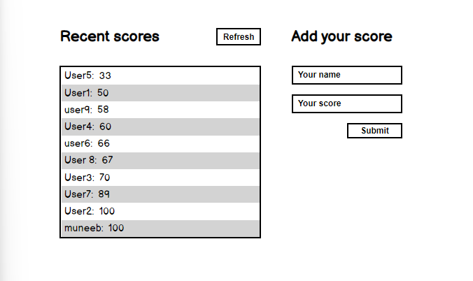

# LeaderBoard Project

Additional description about the project and its features.
-Phase 1. No features added yet.
-Phase 2. Created new game. Implemented refresh button and submit form button to consume api. Used async and await.

### Screenshot

# Getting Started

To get a local copy up and running follow these simple steps.

- You can clone this repo by typing on your terminal.<pre><code>git clone https://github.com/muneebulrehman/Leaderboard.git</code></pre>
- Type <pre><code>cd Leaderboard</code></pre> to access the project on the terminal

## Built With

- HTML and CSS
- Mostly JavaScript
- WebPack used

## Getting Started

To get a local copy up and running follow these simple example steps.

### Setup

Just download or clone the repo.

- Open with your favourite editor.
- Open terminal.
- Run npm install.
- Run npm start.

### Prerequisites

Browser. Any modern browser should do the job.

## Author

👤 **Muneeb Ul Rehman**

- GitHub: [@githubhandle](https://github.com/muneebulrehman)

## 🤝 Contributing

Contributions, issues, and feature requests are welcome!

## Show your support

Give a ⭐️ if you like this project!

## Report an issue

-Go here 👉 [@Link](https://github.com/muneebulrehman/Leaderboard/issues)
